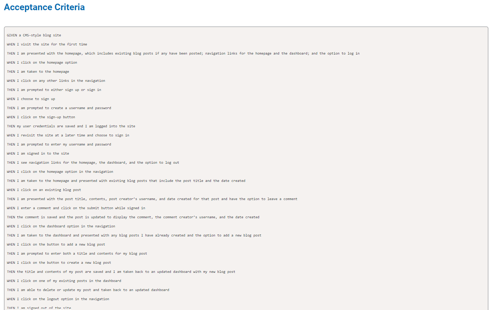

## Project Title

MVC-Challenge-Tech-Blog

## Description
Tech Blog is a CMS-style blog application where developers can publish their thoughts, opinions, and articles on various technical topics. The application follows the MVC architectural pattern and uses technologies like Express.js, Handlebars.js, Sequelize ORM, and PostgreSQL database.

## Table of Contents
Installation
Usage
Technologies Used
Features
Screenshots
Deployment
Contributing
License

## Installation
To run this application locally, follow these steps:

Clone the repository:

bash
Copy code
git clone https://github.com/yourusername/your-repository.git
Navigate into the project directory:

bash
Copy code
cd your-repository
Install dependencies:

bash
Copy code
npm install
Set up your PostgreSQL database:

 ## Usage
Register for a new account or log in with existing credentials.
Navigate through the homepage to view existing blog posts.
Click on a blog post title to view its details and leave comments.
Access the dashboard to manage your own blog posts (create, edit, delete).
Log out from the navigation menu when done.

## Technologies Used
Express.js - Web application framework
Handlebars.js - Templating engine for views
Sequelize - Promise-based ORM for Node.js
PostgreSQL - Relational database management system
bcrypt.js - Library to hash passwords
express-session - Session middleware for authentication
connect-session-sequelize - Sequelize session store
dotenv - Module to load environment variables from a .env file

## Features
User authentication (sign up, sign in, log out)
View all blog posts on the homepage
Create, edit, and delete blog posts
Comment on blog posts
Session management with idle timeout

## Screenshots

## Deployment
This application is deployed on Render at Tech Blog.
https://mvc-challenge-tech-blog-12jv.onrender.com

## License
The MIT License (MIT)